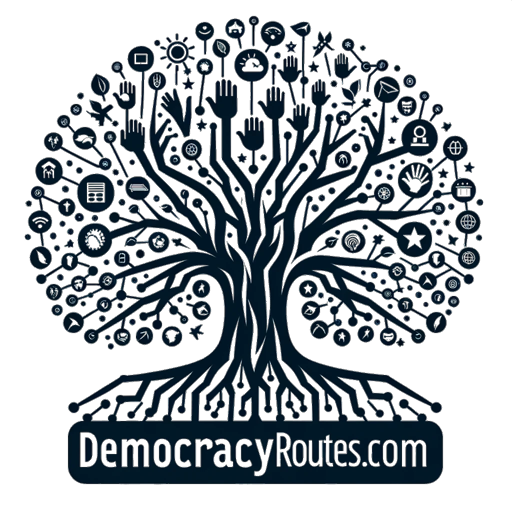
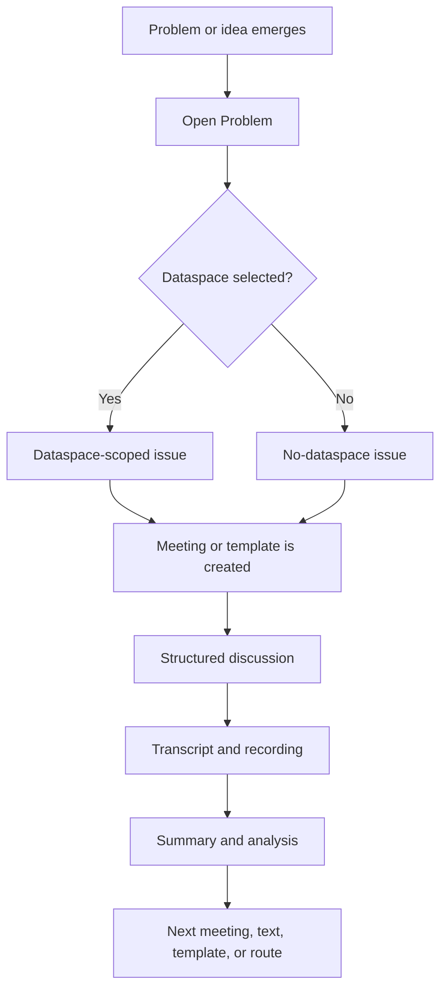
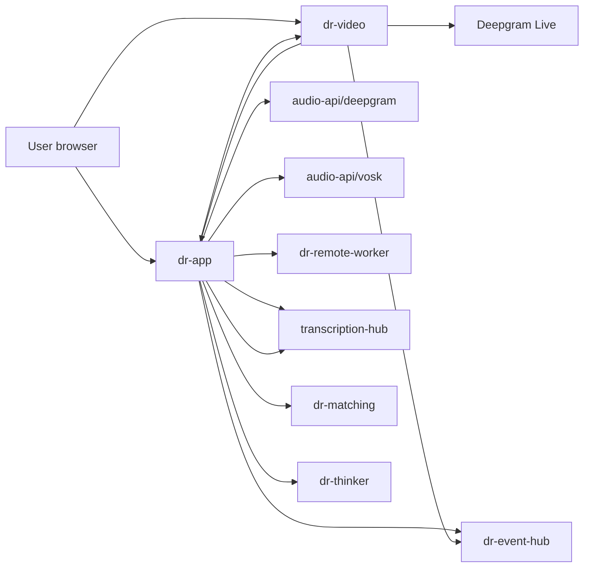
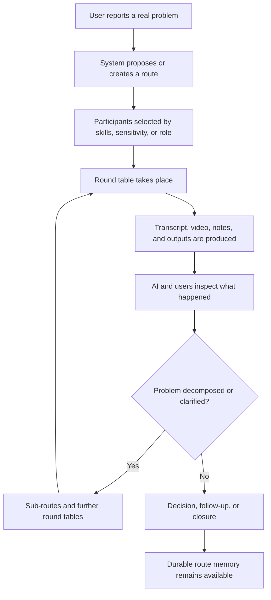
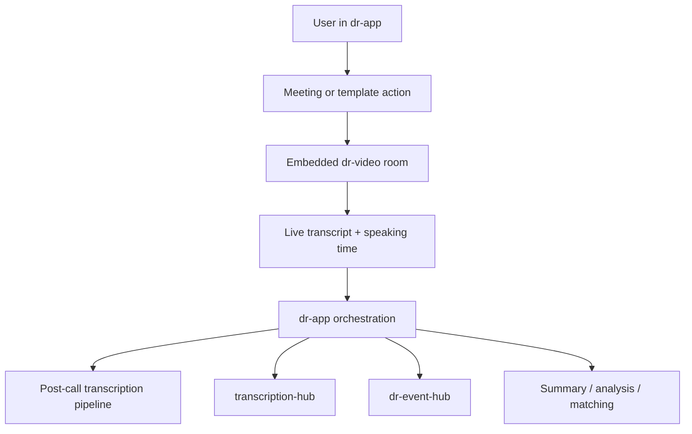

<p align="center">
  
</p>

# Democracy Routes

Democracy Routes is a full-stack platform for structured deliberation, coordinated participation, and post-call political analysis.

This repository contains the operational stack behind that platform: the main app, the embedded video system, transcription services, analysis services, matching services, event logging, and supporting infrastructure.

It should be read in three layers:

1. the political and theoretical layer: why the platform exists
2. the full-stack architecture layer: how the sub-apps fit together
3. the API layer: which services expose which surfaces

The repository also contains two companion documents:

- [Democracy Routes - Whitepaper 2.0.pdf](/root/Democracy%20Routes/Democracy%20Routes%20-%20Whitepaper%202.0.pdf)
- [Proof of Political Power 2.pdf](/root/Democracy%20Routes/Proof%20of%20Political%20Power%202.pdf)

Those documents frame the broader rationale behind the software: deliberation is not treated here as a disposable discussion artifact, but as a durable civic process that can be structured, remembered, analyzed, and linked to ongoing forms of organization.

## Part 1: Theoretical And Product Rationale

### Deliberation as infrastructure

Most digital political discussion today is fragmented:

- calls disappear after they end
- decisions are weakly documented
- participation is difficult to structure
- recurring groups lose context between sessions
- analysis happens manually, late, or not at all

Democracy Routes treats this as an infrastructure problem rather than only a UX problem.

The stack is built around the idea that collective discussion should be:

- structured before it begins
- operational while it runs
- recorded without becoming opaque
- analyzable afterward
- situated inside a durable shared context

That durable context is the `dataspace`.

### Dataspaces, meetings, templates, texts

The platform’s core objects are:

- `dataspaces`
  shared political or organizational spaces where meetings, templates, texts, and analyses accumulate

- `meetings`
  live or post-call discussion rooms, with recording, transcription, summary, and follow-up artifacts

- `templates`
  reusable deliberation structures that define how a meeting or flow should unfold

- `texts`
  editable textual artifacts connected to a dataspace

In that model, a meeting is not an isolated event. It is one episode inside a wider ongoing shared process.

### Who the platform is designed for

The whitepaper is explicit that Democracy Routes is not aimed at a single user archetype.
It is intended to be adaptable across several political and organizational contexts:

- `youth`
  people who want to engage politically without first passing through a full theoretical education

- `citizens`
  people who perceive a concrete problem around them and need a path from frustration to structured participation

- `policymakers`
  actors who need better-organized public input than what generic social media can provide

- `political philosophers`
  people interested in simulating and testing alternative decision-making systems

- `organizations and companies`
  teams that need repeatable problem-solving round tables, summaries, and cross-team coordination

This matters at product level: the stack is not only a meeting app. It is a system for turning heterogeneous problems into structured collaborative processes.

### Why structured templates matter

Templates exist because open-ended discussion alone often reproduces:

- unequal speaking time
- vague outcomes
- facilitation drift
- weak comparability across sessions

The template system lets facilitators define modules such as:

- start
- participants
- discussion rounds
- pauses
- prompts
- notes
- forms
- recording
- matching
- embeds and partner modules

This makes deliberation design explicit rather than implicit.

### Routes, round tables, and the automatic organizer

The conceptual unit described in the whitepaper is the `route`.

A route is not just one meeting. It is a chain of problem-solving episodes built around a real issue:

- the user starts from a concrete problem
- the platform identifies relevant people, skills, or sensitivities
- one or more round tables are organized
- each round table produces outputs
- the problem can be decomposed into sub-problems
- additional round tables can be organized in parallel or in sequence

In that model:

- a `round table` is one concrete deliberative encounter
- a `route` is the larger path through which a problem is worked on until it is clarified, transformed, or resolved

The role of AI in this model is not only summarization. The whitepaper describes it as an `automatic organizer`:

- helping decompose problems into sub-problems
- suggesting which people should be involved
- linking new deliberation to previous related material
- continuing organizational work even when no facilitator is manually rebuilding the next step

That logic is visible today in a simpler operational form through templates, analyses, open problems, meeting creation, matching, and transcript-based recap.

### Documents, inputs, and route memory

The whitepaper treats deliberation as a production of documents, not only speech.

Each round table can generate:

- `document output`
  minutes, transcript, summary, and signed/confirmed records of what happened

- `document input`
  comments, texts, articles, notes, and other asynchronous material that supports or contests the discussion

- `decisions`
  explicit branch points when several options exist

- `processes`
  investigations or inquiry-oriented steps when the issue is still unclear

This is important because Democracy Routes is not built around a single chat log. It is built around accumulating deliberative memory in a form that can later be analyzed, navigated, and reused.

### Why transcription and analysis are part of the core stack

Transcription is not an accessory in this platform.
It is one of the key ways the platform turns ephemeral discussion into:

- searchable memory
- recap artifacts
- speaker-level context
- evidence for summaries
- dataspace-level analysis

Similarly, AI features are not intended as generic “chatbot” additions.
They are used here to support:

- meeting recap
- template creation assistance
- dataspace analysis
- matching support
- remote-worker and transcription workflows

The whitepaper adds two stronger design constraints:

- AI should not function as an opaque black box
- AI activity should be tracked, inspectable, and segmentable inside the broader process

That is why this repository contains explicit event logging, transcript stores, analysis surfaces, and increasingly structured AI runtime traces instead of only one-shot generation calls.

### Transparency, integrity, and non-black-box AI

The whitepaper frames Democracy Routes as a response to two different kinds of opacity:

- social opacity
  people speak, but the process is forgotten or flattened afterward

- technical opacity
  AI systems produce outputs without leaving a legible process trail

The intended answer is a stack where:

- discussions can be recorded
- transcripts can be inspected
- AI-generated outputs can be related back to source material
- process artifacts can be hashed, signed, or immutably referenced

The blockchain layer described in the whitepaper should be read here as a commitment to integrity and traceability, even when the currently deployed stack is still a conventional web architecture around those goals.

### Virtual routes and latent connections between problems

Another important concept from the whitepaper is the `virtual route`.

Two problems that appear separate at first can converge around shared causes or secondary themes. A system that records discussion well can later discover those links:

- lack of public space
- lateness or low participation
- funding constraints
- housing pressure
- institutional bottlenecks

The current repository does not yet implement the full theoretical virtual-route engine described in the document, but the direction is already visible in:

- open problems
- dataspace-level accumulation
- transcript search and recap
- related templates and analyses

### Political direction

### Political direction

The broad direction behind Democracy Routes is to help groups move from:

- discussion

to:

- documented discussion
- structured participation
- recurring collective memory
- analyzable political process
- eventually stronger organizational capacity

The software in this repository is the operational substrate for that direction.

### Proof of Political Power

The companion PoPP document extends the platform from deliberation software toward a broader governance thesis.

Its key claim is that political authority should not be tied only to wealth or stake, but to recorded political participation. In that frame:

- time is finite and non-accumulable
- participation in round tables is a political action
- recorded deliberation becomes a form of civic proof
- governance power should not be endlessly accumulable or tradable like capital

The current stack is not yet a full PoPP blockchain implementation. But several pieces already align with that logic:

- recorded round tables
- transcripts and summaries
- participant-linked speaking and contribution traces
- durable process memory
- explicit concern for integrity and auditability

So PoPP should be read as part of the strategic horizon of the platform, not as a claim that the current repository already ships that full governance system.

### Platform logic flow



## Part 2: Full Stack Architecture

## Repository Topology

Top-level directories:

- `services/`
- `audio-api/`
- `infra/`
- `scripts/`
- `contracts/`
- `docs/`

Primary documents:

- [README.md](/root/Democracy%20Routes/README.md)
- [Democracy Routes - Whitepaper 2.0.pdf](/root/Democracy%20Routes/Democracy%20Routes%20-%20Whitepaper%202.0.pdf)
- [Proof of Political Power 2.pdf](/root/Democracy%20Routes/Proof%20of%20Political%20Power%202.pdf)

## Agent Handoff

This section is for external coding agents working on this repo.

### What this repo is

- `services/dr-app`
  the main Next.js 14 app; owns product UI, auth, Prisma schema, templates, flows, meetings, dashboard, admin, AI summaries, and most orchestration logic

- `services/dr-video`
  the embedded WebRTC / mediasoup video service; owns live room runtime, live transcription capture, and pushes live transcript lines back into `dr-app`

- `services/dr-matching`
  grouping / remix backend used by flows

- `services/dr-event-hub`
  event and log collection

- `services/transcription-hub`
  transcription pipeline support

The repo is operationally centered on `dr-app` and `dr-video`.

### Product model

- `dataspace`
  long-lived shared context

- `meeting`
  one concrete room/call

- `template`
  reusable process definition

- `flow`
  executable runtime instance created from a template

- `discussion`
  the current user-facing term; do not reintroduce the old visible `pairing` label

- `grouping`
  the current user-facing module for forming / reforming rooms

### Important runtime facts

- `dr-app` uses Prisma with SQLite
- `dr-app` startup applies:
  - `prisma db push`
  - Prisma client generation
  - seed
- schema changes usually require a `dr-app` rebuild/recreate
- `dr-video` is a separate service and must be rebuilt separately when live-call behavior changes
- proxy health is typically checked on:
  - `http://127.0.0.1:8088/`

### Current architecture constraints

- legacy flow execution still exists in some places as pair-oriented logic
- newer public citizen-assembly work uses a room-based runtime path
- room-based flows use:
  - `PlanParticipantSession`
  - `PlanRoom`
  - `PlanRoomMember`
- public room-based flows now support:
  - registered users
  - guest join via token

### Live transcription facts

- live providers currently include:
  - `DEEPGRAMLIVE`
  - `GLADIALIVE`
- post-call providers are separate from live providers
- `dr-video` pushes live transcript lines to:
  - `/api/meetings/:id/live-transcript`
- when working on live transcript UX, inspect both:
  - `services/dr-video/public/app.js`
  - `services/dr-app/src/app/meetings/[id]/LiveTranscriptPanel.tsx`

### Recent product decisions that should be preserved

- visible UI language should use:
  - `Discussion`
  - `Grouping`
  not:
  - `Pairing`
  - `Matching` as the primary visible label

- flow settings should stay runtime-only
- template logic belongs in the builder, not execution pages
- AI participants are a live-transcription feature, not a generic post-call feature
- dashboard has:
  - `Notifications` tab
  - `Open Problems` in both the dedicated tab and overview

### Practical workflow

- for code changes in `dr-app` only:
  - rebuild/recreate `dr-app`

- for code changes in `dr-video` only:
  - rebuild/recreate `dr-video`

- for changes spanning live meeting UX or transcript flow:
  - rebuild/recreate both `dr-app` and `dr-video`

- after deploy, verify:
  - container status
  - proxy health
  - relevant page or API path

### Things to check before changing architecture

- whether the path is legacy pair runtime or room-based runtime
- whether the change belongs to:
  - template builder
  - flow runtime
  - meeting runtime
- whether a visible naming change would conflict with the `Discussion` / `Grouping` direction

### Good starting files

- `services/dr-app/prisma/schema.prisma`
- `services/dr-app/src/app/api/flows/[id]/current/route.ts`
- `services/dr-app/src/app/api/flows/[id]/join/route.ts`
- `services/dr-app/src/app/flows/[id]/ParticipantViewClient.tsx`
- `services/dr-app/src/app/meetings/[id]/LiveTranscriptPanel.tsx`
- `services/dr-video/public/app.js`
- `services/dr-video/server.js`

## Core Services

### Stack interaction map



### Runtime model

At system level, the stack can be understood as three layers:

- `interaction layer`
  browsers, pages, builders, meeting UI, embedded call UI

- `process layer`
  meeting orchestration, template logic, open problems, analyses, remote workers, AI helpers

- `evidence layer`
  transcripts, recordings, event logs, participation stats, summaries, and other durable artifacts

That distinction matters because Democracy Routes is not only serving HTML pages. It is constantly translating between:

- live interaction
- structured process design
- persistent deliberative records

### Conceptual process model

The whitepaper’s deeper model can be summarized like this:



### `services/dr-app`

This is the main product shell.

Responsibilities:

- authentication and account management
- dashboard
- dataspaces
- meetings
- template workspace
- modular builder
- structured builder
- texts
- admin pages
- file upload surfaces
- AI summaries and analyses
- orchestration of other internal services

In product terms, `dr-app` is the control plane of the system.

### `services/dr-video`

This is the embedded RTC/video layer.

Responsibilities:

- room join and leave
- mediasoup transport lifecycle
- microphone and camera device management
- local and remote media track handling
- live recording
- live transcript forwarding
- participation voice-activity / speaking-time tracking
- client and server media logging

It is not only a UI shell around a call: it is a media execution service.

### `services/transcription-hub`

Canonical transcript and session store.

Responsibilities:

- receive finalized transcription payloads
- store transcript sessions in Postgres
- expose latest session data by meeting
- expose deliberation/session artifacts back to other services

### `services/dr-event-hub`

Central event logging service.

Responsibilities:

- receive structured event payloads from other services
- store operational events
- expose recent events and summaries

This is useful for debugging and operations, but it is not a full observability platform.

### `services/dr-thinker`

Analysis service.

Responsibilities:

- AI recap and analysis flows
- analysis endpoints used by `dr-app`
- structured analysis support across plans/flows

### `services/dr-matching`

Matching and rematching service.

Responsibilities:

- store matching settings
- run AI-assisted or rules-based matching
- expose run history

### `services/dr-remote-worker`

Remote post-call worker surface.

Responsibilities:

- browser worker session bootstrap
- job claim, heartbeat, checkpoint, completion
- remote transcription worker lifecycle

## Audio API Services

### `audio-api/deepgram`

Deepgram-oriented transcription/admin surface.

Used for:

- Deepgram-based transcription workflows
- admin/audio handling

### `audio-api/vosk`

Vosk-oriented transcription/admin surface.

Used for:

- Vosk-based transcription workflows
- admin/audio handling

## Infrastructure Layer

### `infra/nginx`

Single-domain routing through the reverse proxy.

Public routing defaults:

- `/` -> `dr-app`
- `/video/` -> `dr-video`
- `/audio-admin/deepgram/` -> `audio-api/deepgram`
- `/audio-admin/vosk/` -> `audio-api/vosk`

Internal services generally remain server-to-server.

## Runtime Model

The core runtime loop looks like this:

1. a user interacts with `dr-app`
2. `dr-app` may embed `dr-video` for live meetings
3. `dr-video` sends live transcript and participation data back to `dr-app`
4. `dr-app` triggers or reads transcription pipelines
5. finalized transcript data may be pushed into `transcription-hub`
6. events are forwarded into `dr-event-hub`
7. AI recap, analysis, and matching services are called as needed

This means the platform is intentionally multi-service rather than monolithic:

- UI and orchestration live in `dr-app`
- media and RTC live in `dr-video`
- transcription persistence is centralized
- operational events are centralized
- analysis and matching are delegated to dedicated services



## Local Development And Boot

Main compose files:

- [docker-compose.yml](/root/Democracy%20Routes/docker-compose.yml)
- [docker-compose.dev.yml](/root/Democracy%20Routes/docker-compose.dev.yml)

Typical startup:

```bash
cp .env.example .env
docker compose up -d --build
```

Default local public entrypoint:

- `http://localhost:8088/`

Default public subpaths:

- `http://localhost:8088/video/`
- `http://localhost:8088/audio-admin/deepgram/`
- `http://localhost:8088/audio-admin/vosk/`

Main environment groups are documented in [`.env.example`](/root/Democracy%20Routes/.env.example).

## Part 3: Detailed API Map

This section is organized by service.
For `dr-app`, the list is detailed because that service exposes the largest API surface.

### API lifecycle overview

```mermaid
flowchart TD
    OP[Open problem draft] --> OPA[/api/open-problems/assistant]
    OPA --> OPC[/api/open-problems]
    OPC --> DS[Optional dataspace attachment]
    DS --> M[/api/meetings]
    M --> LV[/api/meetings/:id/live-transcript]
    M --> PT[/api/meetings/:id/transcription]
    LV --> TH[transcription-hub]
    PT --> DG[audio-api/deepgram]
    PT --> VOSK[audio-api/vosk]
    PT --> RW[dr-remote-worker]
    DG --> SUM[/api/meetings/:id/summary]
    VOSK --> SUM
    RW --> SUM
```

## `dr-app` API

Base implementation root:

- `services/dr-app/src/app/api`

### Auth and account

- `GET|POST /api/auth/[...nextauth]`
  NextAuth session and auth handler

- `POST /api/register`
  user registration

- `POST /api/auth/forgot-password`
  begin password reset flow

- `POST /api/auth/reset-password`
  complete password reset flow

- `POST /api/account/change-password`
  authenticated password change

- `GET|POST /api/account/email`
  account email actions

- `GET|POST /api/account/profile`
  account profile actions

### Users

- `GET /api/users`
  user lookup, used for invite autocomplete and selection surfaces

### Logs

- `POST /api/logs`
  client log/event ingestion into app logging

### Uploads and assets

- `POST /api/uploads/[kind]`
  upload by kind

- `GET /api/uploads/[kind]/[file]`
  retrieve uploaded asset by kind and file

- `GET|POST /api/posters`
  poster asset handling

- `GET|POST /api/meditation/audio`
  meditation audio list/upload

- `GET /api/meditation/audio/[file]`
  meditation audio file retrieval

- `GET /api/resources/download/[key]`
  tracked resource download endpoint

### Feedback

- `POST /api/feedback`
  user feedback submission

- `POST /api/feedback/transcribe`
  feedback-related transcription support

### Dataspaces

- `GET|POST /api/dataspaces`
  list/create dataspaces

- `GET|PATCH|DELETE /api/dataspaces/[id]`
  dataspace detail mutation

- `POST /api/dataspaces/[id]/invite`
  invite registered users into a dataspace

- `POST /api/dataspaces/[id]/join`
  join a dataspace

- `POST /api/dataspaces/[id]/leave`
  leave a dataspace

- `GET|POST /api/dataspaces/[id]/preferences`
  notification preferences

- `POST /api/dataspaces/[id]/subscribe`
  subscribe to dataspace activity

- `POST /api/dataspaces/[id]/unsubscribe`
  unsubscribe from dataspace activity

- `POST /api/dataspaces/[id]/share`
  share dataspace externally / make shareable

- `POST /api/dataspaces/[id]/unshare`
  undo shared mode

- `POST /api/dataspaces/[id]/telegram-link`
  Telegram group linking

- `GET|POST /api/dataspaces/[id]/analysis`
  dataspace AI analysis read/create

- `GET /api/dataspaces/[id]/analytics/graph`
  structural graph for meetings, templates, and participants inside a dataspace

- `GET /api/dataspaces/recent`
  recent dataspaces for header/navigation use

- `GET /api/dataspaces/invitations`
  dataspace invitation list

- `POST /api/dataspaces/invitations/[id]/accept`
  accept dataspace invitation

### Meetings

```mermaid
flowchart TD
    CREATE[POST /api/meetings] --> ROOM[Room created]
    ROOM --> LIVE[GET|POST /api/meetings/:id/live-transcript]
    ROOM --> STATS[GET|POST /api/meetings/:id/participation-stats]
    ROOM --> REC[GET /api/meetings/:id/recordings]
    ROOM --> POST[GET|POST /api/meetings/:id/transcription]
    POST --> SUMMARY[GET /api/meetings/:id/summary]
```

- `GET|POST /api/meetings`
  list/create meetings

- `GET|PATCH|DELETE /api/meetings/[id]`
  meeting detail mutation and deletion

- `POST /api/meetings/[id]/deactivate`
  deactivate meeting

- `POST /api/meetings/[id]/join`
  join a meeting

- `POST /api/meetings/[id]/leave`
  leave a meeting

- `GET|POST /api/meetings/[id]/members`
  meeting membership management / invite by email

- `GET /api/meetings/[id]/users`
  user autocomplete scoped to meeting invite logic

- `POST /api/meetings/[id]/invite-guest`
  guest invite when no registered user exists

- `GET|POST /api/meetings/[id]/live-transcript`
  live transcript ingestion and retrieval

- `GET|POST /api/meetings/[id]/participation-stats`
  speaking-time / voice-activity stats ingestion and retrieval

- `GET|POST /api/meetings/[id]/transcription`
  post-call transcription state, orchestration, and retrieval

- `GET /api/meetings/[id]/transcription/link`
  transcription linkage / fetch helper

- `GET /api/meetings/[id]/summary`
  meeting summary retrieval

- `GET /api/meetings/[id]/recordings`
  meeting recording list

- `GET /api/meetings/[id]/recordings/file`
  meeting recording file retrieval

- `GET /api/meetings/[id]/requests/[inviteId]/approve`
- `GET /api/meetings/[id]/requests/[inviteId]/decline`
  meeting request moderation paths

### Templates and flows

- `GET|POST /api/plan-templates`
  template list/create

- `GET|PATCH|DELETE /api/plan-templates/[id]`
  template detail mutation

- `POST /api/templates/ai`
  AI-assisted template generation/update

- `GET /api/templates/ai/history`
  template AI history

- `POST /api/templates/library-assistant`
  session-local template library assistant

- `GET|POST /api/flows`
  flow list/create

- `GET|PATCH|DELETE /api/flows/[id]`
  flow detail mutation

- `GET /api/flows/[id]/current`
  current execution state

- `POST /api/flows/[id]/start-now`
  start flow immediately

- `POST /api/flows/[id]/skip`
  skip current unit/block

- `POST /api/flows/[id]/join`
  join flow

- `POST /api/flows/[id]/leave`
  leave flow

- `POST /api/flows/[id]/invite`
  invite participant into flow

- `GET|POST /api/flows/[id]/analysis`
  flow analysis

- `GET|POST /api/flows/[id]/recap`
  recap handling

- `POST /api/flows/[id]/record`
  recording hook for flow execution

- `POST /api/flows/[id]/record/transcribe`
  transcription pass for flow recording

- `GET|POST /api/flows/[id]/meditation`
  meditation control

- `POST /api/flows/[id]/meditation/transcribe`
  meditation transcription handling

- `POST /api/flows/[id]/matching/run`
  trigger rematching

- `GET|POST /api/flows/[id]/blocks/[blockId]/text`
  block-specific text handling

- `POST /api/flows/[id]/forms/[blockId]/response`
  form block response submission

- `POST /api/flows/[id]/participants/[participantId]/approve`
- `POST /api/flows/[id]/participants/[participantId]/decline`
  participant moderation

### Texts

- `GET|POST /api/texts`
  list/create texts

- `GET|PATCH|DELETE /api/texts/[id]`
  text detail mutation

### AI agents

- `GET /api/ai-agents`
  public/internal agent option list for meeting/template use

### Admin

#### Admin users

- `GET|POST /api/admin/users`
- `GET|PATCH|DELETE /api/admin/users/[id]`
- `POST /api/admin/users/[id]/resend`
- `POST /api/admin/users/[id]/reset-password`
- `POST /api/admin/users/[id]/validate`

#### Admin registration

- `GET|POST /api/admin/registration/settings`
- `GET|POST /api/admin/registration/codes`
- `GET|PATCH|DELETE /api/admin/registration/codes/[id]`

#### Admin site and analytics

- `GET|POST /api/admin/site-settings`
- `GET /api/admin/analyses`
- `GET /api/admin/feedback`
- `GET /api/admin/embed-auth`

#### Admin backups and inbox

- `GET|POST /api/admin/backups`
- `GET /api/admin/backups/[name]`
- `GET /api/admin/inbox`
- `GET /api/admin/inbox/[uid]`

#### Admin AI agents

- `GET|POST /api/admin/ai-agents`
- `GET|PATCH|DELETE /api/admin/ai-agents/[id]`

#### Admin template modules

- `GET|POST /api/admin/template-modules`
  editable module descriptions used by template AI

#### Admin transcriptions

- `GET /api/admin/transcriptions`
- `POST /api/admin/transcriptions/retry-failed`
- `POST /api/admin/transcriptions/[id]/retry`

#### Admin remote workers

- `GET /api/admin/remote-workers/jobs/demo`
- `GET /api/admin/remote-workers/jobs/meeting-recordings`
- `GET /api/admin/remote-workers/jobs/[id]`

### Integrations

#### Workflow integration

- `GET /api/integrations/workflow/dataspaces`
- `GET|POST /api/integrations/workflow/flows`
- `GET /api/integrations/workflow/flows/[id]`
- `GET /api/integrations/workflow/flows/[id]/recap`
- `GET|PATCH /api/integrations/workflow/meetings`
- `GET /api/integrations/workflow/meetings/[id]`
- `GET /api/integrations/workflow/meetings/[id]/transcription/meta`
- `GET /api/integrations/workflow/meetings/[id]/transcription/participants`
- `GET /api/integrations/workflow/meetings/[id]/transcription/words`
- `GET /api/integrations/workflow/meetings/[id]/transcription/contributions`
- `GET /api/integrations/workflow/users`
- `GET|POST /api/integrations/workflow/meditation/audio`

#### Analyze integration

- `POST /api/integrations/analyze/flows/[id]/analysis`

### Invitations

- `POST /api/invitations/[id]/accept`
- `POST /api/invitations/[id]/decline`

### Telegram

- `POST /api/telegram/webhook`

### Remote workers

- `GET /api/remote-workers/bootstrap`
- `POST /api/remote-workers/register`
- `POST /api/remote-workers/session`
- `POST /api/remote-workers/heartbeat`
- `POST /api/remote-workers/claim`
- `POST /api/remote-workers/events`
- `GET /api/remote-workers/jobs/[id]/audio`
- `POST /api/remote-workers/jobs/[id]/checkpoint`
- `POST /api/remote-workers/jobs/[id]/complete`
- `POST /api/remote-workers/jobs/[id]/fail`

## `dr-video` API

Implementation:

- [server.js](/root/Democracy%20Routes/services/dr-video/server.js)

### Live room and transcription flow

```mermaid
flowchart TD
    ROOM[Live room] --> WS[WebSocket session]
    ROOM --> CHUNK[/api/transcription/chunk]
    ROOM --> RECORD[/api/record/chunk]
    CHUNK --> APP[dr-app live transcript ingestion]
    RECORD --> FINAL[/api/record/finalize]
    FINAL --> POST[Post-call transcription path]
    ROOM --> EVENTS[/api/client-events]
```

### Public pages

- `GET /meet/:roomId`
  embedded/public meeting room page

- `GET /admin`
  admin page for `dr-video`

### HTTP API

- `GET /api/join-url`
  build join and embed URLs

- `POST /api/client-events`
  client-side media event ingestion for structured media debugging

- `POST /api/record/chunk`
  recording chunk upload

- `POST /api/record/finalize`
  finalize recording session

- `POST /api/transcription/chunk`
  live transcription chunk upload

- `POST /api/transcription/finalize`
  finalize live transcription session

- `GET /api/recordings`
  list recordings

- `GET /api/recordings/file`
  retrieve recording file

- `GET /api/recordings/transcript`
  retrieve stored transcript for a recording

- `DELETE /api/recordings`
  delete recording artifacts

- `GET /api/admin/status`
  admin status

- `GET /api/rooms/state`
  room state snapshot

- `POST /api/rooms/close-if-empty`
  cleanup helper for empty rooms

- `POST /api/recording/start`
  request recording start through API

- `GET /api/metrics/hub`
  hub metrics visibility

- `GET /api/health`
  health check

### WebSocket

WebSocket endpoint:

- `/ws`

Main action families inside the WebSocket session:

- room join/leave
- transport creation and connect
- produce / consume
- consumer resume
- recording state changes
- active speaker signals
- chat messages

This service is stateful and media-oriented; much of its operational surface is WebSocket-based rather than REST-based.

## `transcription-hub` API

Implementation:

- [server.js](/root/Democracy%20Routes/services/transcription-hub/server.js)

Endpoints:

- `GET /api/health`
- `POST /api/ingest/finalize`
- `GET /api/sessions/:sessionId`
- `GET /api/sessions/:sessionId/deliberation`
- `GET /api/meetings/:meetingId/latest`

Purpose:

- ingest finalized transcript payloads
- expose transcript sessions and deliberation artifacts
- expose latest transcript session by meeting

## `dr-event-hub` API

Implementation:

- [server.js](/root/Democracy%20Routes/services/dr-event-hub/server.js)

Endpoints:

- `GET /api/health`
- `POST /api/events`
- `GET /api/events`
- `GET /api/events/summary`

Purpose:

- centralized event ingestion
- event listing
- summary views across recent events

## `dr-matching` API

Implementation:

- [server.js](/root/Democracy%20Routes/services/dr-matching/server.js)

Endpoints:

- `GET /api/health`
- `GET /api/settings`
- `POST /api/settings`
- `GET /api/runs`
- `POST /api/match`
- `GET /`

Purpose:

- store matching settings
- run matching jobs
- expose previous runs and configuration

## `audio-api/deepgram`

This service is a Next app, not a small Express surface, so the runtime API is split between app routes and pages.

Its main responsibility is Deepgram-based transcription/admin workflows.

## `audio-api/vosk`

This service is also a Next app focused on Vosk-based transcription/admin workflows.

## Final Notes

- `dr-app` is the broadest and most important API surface
- `dr-video` is the most stateful and media-sensitive part of the stack
- `transcription-hub` and `dr-event-hub` act as specialized persistence layers
- `dr-thinker` and `dr-matching` provide AI and orchestration support rather than serving as primary user-facing shells

This repository is therefore not a single web app. It is a coordinated platform stack for deliberation, participation, transcription, analysis, and meeting operations.
